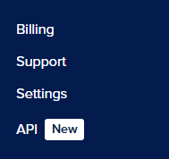

# Setting up a DigitalOcean droplet using doctl and cloud-init

# Table of contents
- [Introduction](#introduction)
- [Installing and setting up doctl](#installing-and-setting-up-doctl)
- [Uploading a custom image to DigitalOcean](#uploading-a-custom-image-to-digitalocean)
- [Setting up SSH keys](#setting-up-ssh-keys)
- [Configuring cloud-init](#configuring-cloud-init)
- [Deploying the droplet](#deploying-the-droplet)
- [Verify everything worked](#verify-everything-worked)

# Introduction
This tutorial will walk you through the process of using the tools `doctl`, and `cloud-init` to set up an Arch Linux droplet on DigitalOcean. 

**Things we'll need:**
<!-- - A local machine running the cloud version of Arch Linux -->
<!-- - A local machine running Microsoft Windows 10/11 -->
- A DigitalOcean account
- An existing Arch Linux droplet
- Neovim (or your preferred text editor)

>[!TIP]
>You will be copying and pasting into your terminal frequently throughout this tutorial. If you're using Command Prompt or Windows Powershell, you can enable copy/paste by clicking the icon on the top left of your terminal and choosing the **Properties** option. Once inside the **Properties** window, make sure to check the **Use Ctrl+Shift+C/V as Copy/Paste** checkbox.
---

# Installing and setting up doctl
`doctl` is the official DigitalOcean command line interface that allows you to do things like creating, configuring, and destroying DigitalOcean resources, such as Droplets. 

To get started, run the command:
```
sudo pacman -S doctl
```
Once you've installed `doctl`, we'll have to create a DigitalOcean Personal Access Token. This token will give `doctl` access to your DigitalOcean account.

1. Login to your DigitalOcean account
2. Find the navigation bar on the left and scroll down to the bottom until you see API



3. Click **API**
4. Click **Generate New Token**
5. Type in a token name
6. Choose your preferred token expiration date
7. Click **Full Access** in the **Scopes** section
8. Click **Generate Token**


>[!IMPORTANT]
>Once you've finished those steps, your token will be generated and you'll be given a token string. The token string will be shown to you only **once**. Ensure you copy it and store it in a safe place as you'll need it to authenticate `doctl`.
\
> 

Next, we'll give `doctl` your newly generated token string. To do that, run this command:
```
doctl auth init
```
You will be prompted to enter your access token string.


Now that your token has been validated, let's check that `doctl` has access to your DigitalOcean account.

Type in this command:
```
doctl account get
```
You should be faced with an output that looks like this:
```
Email                      Droplet Limit    Email Verified    UUID                                        Status
sammy@example.org          10               true              3a56c5e109736b50e823eaebca85708ca0e5087c    active
```
**Congratulations! You've successfully set up `doctl`!**

---

# Uploading a custom image to DigitalOcean
Before we can upload a custom image to DigitalOcean, we'll need to download an Arch Linux cloud image. You can find the latest image here: https://geo.mirror.pkgbuild.com/images/latest/

From the repository linked earlier, you'll want to copy the link to the cloud image ending in `.qcow2`.


>[!TIP]
>You will often see some word or phrase between two angle brackets like this, `<word or phrase>`, throughout this tutorial. This means you need to type your own text here correlating to the word/phrase.

Now that you have the Arch Linux cloud image link copied, we can run this next command to upload the image to your DigitalOcean account:
```
doctl compute image create <custom image name> --image-url <Arch Linux cloud image URL ending in .qcow2> --region sfo3 --image-distribution "Arch Linux"
```
>[!NOTE]
>For the purposes of this tutorial, we used the `sfo3` region slug to fulfill the `--region` argument. You can find a list of region slugs by running this command: 
>```
>doctl compute region list
>```

To verify that your custom image was successfully uploaded to DigitalOcean, run this command:
```
doctl compute image list-user
```
You should see an output that looks something like this:
```
ID           Name          Type          Distribution    
165123456    Your Image    custom        Arch Linux
```
**Congrats! You've successfully uploaded a custom Arch Linux cloud image to your DigitalOcean account.**

---

<!--add part about uploading pub key to DigitalOcean and rewrite from droplet perspective not windows-->
# Setting up SSH keys
Secure shell (SSH) is a network protocol used to initiate secure connections over an unsecured network. Through the secure connection, you can do things such as sending commands or transferring files, and more. SSH will be essential to accessing your DigitalOcean droplets.

We'll get started by creating an SSH public/private key-pair on your Arch Linux droplet using this command::
```
ssh-keygen -t ed25519 -f C:\Users\<your username>\.ssh\<key name> -C <youremail@email.com>
```
You will be prompted to enter a passphrase. This passphrase will be used every time you connect to your droplet via SSH.

Once you've generated the public/private key-pair, you'll be able to find both keys in the .ssh folder within your user folder. They will look something like this: `bobs-key` and `bobs-key.pub`. `bobs-key` (the private key) will stay on your Arch Linux droplet, while `bobs-key.pub` will be uploaded to DigitalOcean to be used by your droplets.

You can do that by running this command:
```
doctl compute ssh-key import <key identifier> --public-key-file ~/.ssh/<key name>.pub
```

SSH will use this pair of keys to send back-and-forth encrypted messages from your local machine to the DigitalOcean droplet. The messages can only be decrypted if the public and private keys match. 


**Now that you have new a new pair of SSH keys, you can head on over to your Arch Linux DigitalOcean droplet.**

---

# Configuring cloud-init
`Cloud-init` is a tool used to automate the initializtion of cloud instances such as the Arch Linux droplet you'll be deploying at the end of this tutorial. `Cloud-init` will allow your droplet to automatically create users, install software, authorize SSH keys, run scripts, and more. 

To get started, let's create and open a `cloud-init` configuration file in neovim:
```
nvim ~/cloud-config.yml
```
>[!NOTE]
>If that command doesn't work, you might not have neovim installed on your system. Run the command:
>```
>sudo pacman -S neovim
>```

Next, copy and paste this code into your file, changing the necessary fields:
```
#cloud-config
users:
  - name: <user name>
    primary_group: <user group>
    groups: wheel
    shell: /bin/bash
    sudo: ['ALL=(ALL) NOPASSWD:ALL']
    ssh-authorized-keys:
      - ssh-ed25519 <your ssh public key string>

packages:
  - ripgrep
  - rsync
  - neovim
  - fd
  - less
  - man-db
  - bash-completion
  - tmux

disable_root: true
```
>[!NOTE]
>You can run the command:
>```
>cat ~/.ssh/<your ssh key ending in .pub>
>```
>And then select all of the displayed content and press Ctrl+Shift+C to copy it to your clipboard.

**Now that you have a cloud-init configuration file, we can move on to deploying the droplet!**

---

# Deploying the droplet
Before running the command to deploy the droplet, you'll need to run some preliminary commands to get the IDs of your uploaded SSH key, custom Arch Linux image ID, and optionally, the region slug.

1. This command will list your custom images with ID being the first piece of text:
```
doctl compute image list-user
```

2. This command will list your SSH keys and their IDs:
```
doctl compute ssh-key list
```

3. This command will give you a list of valid region slugs:
```
doctl compute region list
```
Once you have all the necessary information you need, you can run this command:

```
doctl compute droplet create --image <image ID> --size s-1vcpu-1gb --ssh-keys <SSH key ID> --region <your preferred region slug> --user-data-file ~/cloud-config.yml --wait <droplet name>
```
>[!NOTE]
>It may seem like your terminal froze, but just let it work and you'll eventually be greeted with an output detailing the information about the droplet you just created.

**Congrats! You just deployed a droplet using `doctl` and `cloud-init`! Now you just need to make sure everything worked.**

---

# Verify everything worked
Now that your droplet is up and running, you should try and connect to it via SSH. 

First, you'll need to get the IPv4 address your droplet is running on. You can use this command to list your running droplets and find the IPv4 address:
```
doctl compute droplet list
```
Once you have the IPv4 address you can immediately try using SSH to connect to your droplet with this command:
```
ssh -i ~/.ssh/<private key> <username>@<IPv4 address>
```
But you can make this easier by creating an SSH configuration file and entering your droplet's information into it. Run this command to create your own SH configuration file:
```
nvim ~/.ssh/config
```
Paste this text into your config file, replacing the necessary fields:
```
Host <droplet alias>
  HostName <droplet IPv4 address>
  User <username>
  PreferredAuthentications publickey
  IdentityFile ~/.ssh/<private key>
  StrictHostKeyChecking no
  UserKnownHostsFile /dev/null
```
Now you should be able to connect to your by simply running this command:
```
ssh <droplet alias>
```
**Congrats! You've made it to the end of the tutorial!**
<!--
[^1]: doctl is a command-line interface tool used to interact with DigitalOcean's cloud services.
[^2]: cloud-init is an industry standard tool used for cloud instance initialization. 
-->