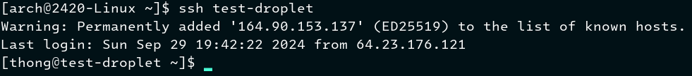

# Setting up a DigitalOcean droplet using doctl and cloud-init

# Table of contents
- [Introduction](#introduction)
- [Installing and setting up doctl](#installing-and-setting-up-doctl)
- [Uploading a custom image to DigitalOcean](#uploading-a-custom-image-to-digitalocean)
- [Setting up SSH keys](#setting-up-ssh-keys)
- [Configuring cloud-init](#configuring-cloud-init)
- [Deploying the droplet](#deploying-the-droplet)
- [Verify everything worked](#verify-everything-worked)

# Introduction
This tutorial will walk you through the process of using the tools `doctl`, and `cloud-init` to set up an Arch Linux droplet on DigitalOcean. 

**Things we'll need:**
- A DigitalOcean account
- An existing Arch Linux droplet
- Neovim (or your preferred text editor)

>[!TIP]
>You will be copying and pasting into your terminal frequently throughout this tutorial. If you're using Command Prompt or Windows Powershell, you can enable copy/paste by clicking the icon on the top left of your terminal and choosing the **Properties** option. Once inside the **Properties** window, make sure to check the **Use Ctrl+Shift+C/V as Copy/Paste** checkbox.
---

# Installing and setting up `doctl`
`doctl` is the official DigitalOcean command line interface that allows you to do things like creating, configuring, and destroying DigitalOcean resources, such as Droplets[^1]. 

To get started, run the command:
```
sudo pacman -S doctl
```
<details>
<summary>Command details</summary>

- `sudo` - Command that temporarily gives the user root privilege.
- `pacman` - This is the package manager for Arch Linux.
  - Package managers are used on Linux systems to install programs
- `-S` - This is an option for `pacman` that stands for synchronize packages. It essentially installs a specified package from Arch's remote repositories[^2].
- `doctl` - An argument given to the `-S` option that tells `pacman` to install `doctl`.


</details>

Once you've installed `doctl`, we'll have to create a DigitalOcean Personal Access Token. This token will give `doctl` access to your DigitalOcean account.

1. Login to your DigitalOcean account
2. Find the navigation bar on the left and scroll down to the bottom until you see API


3. Click **API**
4. Click **Generate New Token**
5. Type in a token name
6. Choose your preferred token expiration date
7. Click **Full Access** in the **Scopes** section
8. Click **Generate Token**

>[!IMPORTANT]
>Once you've finished those steps, your token will be generated and you'll be given a token string. The token string will be shown to you only **once**. Ensure you copy it and store it in a safe place as you'll need it to authenticate `doctl`.
\
> 

Next, we'll give `doctl` your newly generated token string. To do that, run this command:
```
doctl auth init
```
<details>
<summary>Command details</summary>

- `doctl` - This tells your system to run the `doctl` program.
- `auth` - An option for `doctl` that allows you to use its authentication tools.
- `init` - An option for `auth` that will initialize `doctl` to use your DigitalOcean account[^3].

</details>

You will be prompted to enter your access token string that you copied earlier.


Now that your token has been validated, let's check that `doctl` has access to your DigitalOcean account.

Type in this command:
```
doctl account get
```
<details>
<summary>Command details</summary>

- `account` - An option for `doctl` that allows you to retrieve information about your DigitalOcean accounts[^4].
- `get` - An option for `account` that will tell `doctl` to retrieve account profile details[^4].

</details>

You should be faced with an output that looks like this:
```
Email                      Droplet Limit    Email Verified    UUID                                        Status
sammy@example.org          10               true              3a56c5e109736b50e823eaebca85708ca0e5087c    active
```
**Congratulations! You've successfully set up `doctl`!**

---

# Setting up SSH keys
Secure shell (SSH) is a network protocol used to initiate secure connections over an unsecured network[^5]. Through the secure connection, you can do things such as sending commands or transferring files, and more[^5]. SSH will be essential to accessing your DigitalOcean droplets.

>[!TIP]
>You will often see some word or phrase between two angle brackets like this, `<word or phrase>`, throughout this tutorial. This means you need to type your own text here corresponding to the word/phrase.

We'll get started by creating an SSH public/private key-pair on your Arch Linux droplet using this command::
```
ssh-keygen -t ed25519 -f ~/.ssh/<key name> -C <youremail@email.com>
```
<details>
<summary>Command details</summary>

- `ssh-keygen` - A tool for creating new SSH key-pairs.
- `-t` - An option for `ssh-keygen` that allows you to choose your preferred encryption algorithm 
- `ed25519`- The argument for `-t` which is a new algorithm added to OpenSSH[^6].
- `-f` - An option for `ssh-keygen` that allows you to specify a file path and name[^6].
- `~/.ssh/<key name>` - The argument given to `-f`. `<key name>` should be replaced with a name of your choice.
- `-C` - An option for `ssh-keygen` that allows you to add a comment to your SSH key-pair. You can type anything you want here, but for this tutorial we'll be using your email.
- `<youremail@email.com>` - The argument given to `-C`. Enter your email here.

</details>

You will be prompted to enter a passphrase. This passphrase will be used every time you connect to your droplet via SSH. If you don't want to use a password, you can just leave the prompt blank and press **ENTER** twice.

Once you've generated the public/private key-pair, you'll be able to find both keys in the .ssh folder within your user folder. They will look something like this: `bobs-key` and `bobs-key.pub`. `bobs-key` (the private key) will stay on your Arch Linux droplet, while `bobs-key.pub` will be uploaded to DigitalOcean to be used by your droplets.

You can upload your public key to DigitalOcean by running this command:
```
doctl compute ssh-key import <key identifier> --public-key-file ~/.ssh/<key name>.pub
```
<details>
<summary>Command details</summary>

- `compute` - An option for `doctl` that lets the user use subcommands to manage DigitalOcean resources[^7].
- `ssh-key` - An option for `compute` that lets the user manage their SSH keys[^7].
- `import` - An option for `ssh-key` that will import an SSH public key from your computer to your DigitalOcean account[^8].
- `<key identifier>` - An argument for `ssh-key import`. This is how you will distinguish this specific key between other keys on your DigitalOcean account.
- `--public-key-file` - An required option for `import` to specify your public key path on your system[^9].
- `~/.ssh/<key name>.pub` - An argument for `--public-key-file`. Enter the path to your public key you created earlier here.

</details>

SSH is a more secure method of authentication than a regular username and password because SSH will essentially use this pair of keys to send back-and-forth encrypted messages from your local machine to the DigitalOcean droplet. The messages can only be decrypted if the public and private keys match[^5]. 

Now use this command to verify your SSH public key has been uploaded to your DigitalOcean account:
```
doctl compute ssh-key list
```
<details>
<summary>Command details</summary>

- `list` - An option for `ssh-key` that will list all SSH keys associated with your DigitalOcean account[^8].

</details>

You should see a list of your SSH keys like this:


**Now that you have new a new pair of SSH keys, you can head on over to your Arch Linux DigitalOcean droplet.**

---

# Configuring cloud-init
`Cloud-init` is a tool used to automate the initializtion of cloud instances such as the Arch Linux droplet you'll be deploying at the end of this tutorial[^10]. `Cloud-init` will allow your droplet to automatically create users, install software, authorize SSH keys, run scripts, and more[^10]. 

To get started, let's create and open a `cloud-init` configuration file in neovim:
```
nvim ~/cloud-config.yml
```
<details>
<summary>Command details</summary>

- `nvim` - This will run the program Neovim
- `~/cloud-config.yml` - The argument passed to Neovim. It tells Neovim to either open the file at this location, or create and open the file at this location if it doesn't already exist.

</details>


>[!NOTE]
>If that command doesn't work, you might not have neovim installed on your system. Run the command:
>```
>sudo pacman -S neovim
>```

Next, copy and paste this code into your file by pressing **i** on your keyboard to enter **INSERT** mode. Replacing the necessary fields:
```
#cloud-config
users:
  - name: <user name>
    primary_group: <user group>
    groups: wheel
    shell: /bin/bash
    sudo: ['ALL=(ALL) NOPASSWD:ALL']
    ssh-authorized-keys:
      - <your ssh public key string>

packages:
  - ripgrep
  - rsync
  - neovim
  - fd
  - less
  - man-db
  - bash-completion
  - tmux

disable_root: true
```
<details>
<summary>cloud-config.yml details</summary>

- `#cloud-config` - This is NOT a comment. This line tells `cloud-init` that this file is a cloud config file.
- `users:` - This line will tell `cloud-init` to add users to the system[^11].
- `- name: <username>` - This line begins the entry for a new user you want to add to your system. Options configured underneath this line will be associated with this specific user.
- `primary_group: <user group>` - This line will assign a primary group to the user. The primary group is the group that Linux assigns to files that the user creates[^12]. 
  - You should generally name the primary group the same as the user username.
- `groups: wheel` - This line will assign the user to additional groups[^12].
  - The **wheel** group essentially gives the user access to the `sudo` command.
- `shell: /bin/bash` - This line assigns the default shell for the user[^12]. In this case, we've assigned the user the Bash shell.
- `sudo: ['ALL=(ALL) NOPASSWD:ALL']` - This line accepts a sudo "rule string"[^12].
  - The "rule string" `['ALL=(ALL) NOPASSWD:ALL']` gives the user access to `sudo` commands without having to enter the root password.
- `ssh-authorized-keys:` - This line will add a public key to the user's authorized_keys file, allowing access to the system via SSH key-pair[^12].
- `packages:` - This line will tell `cloud-init` to install the following packages.
- `- ripgrep`, `- rsync`, `- neovim`... - These are packages you want `cloud-init` to install on your system.
- `disable_root: true` - This disables the ability for the user to SSH into the cloud instance as the root user[^13].

</details>

After you've pasted the text above, save and exit your file by typing `:wq` and pressing **ENTER**.


>[!NOTE]
>You can run the command:
>```
>cat ~/.ssh/<your ssh key ending in .pub>
>```
>And then select all of the displayed content and press Ctrl+Shift+C to copy it to your clipboard to paste it into your cloud-config.yml file.

Once you're finished configuring your cloud-config.yml file, you can type the command:
```
cat ~/cloud-config.yml
```
<details>
<summary>Command details</summary>

- `cat` - A tool used to read and output the contents of a given file.
- `~/.ssh/cloud-config.yml` - The argument given to `cat` to read.

</details>

It should look something like this:


**Now that you have a cloud-init configuration file, we can move on to deploying the droplet!**

---

# Deploying the droplet
Before running the command to deploy the droplet, you'll need to run some preliminary commands to get the IDs of your uploaded SSH key, custom Arch Linux image ID, and the region slug.

1. This command will list your custom images with ID being the first piece of text:
```
doctl compute image list-user
```
<details>
<summary>Command details</summary>

- `image` - An option for `compute` that lets you manage images on your DigitalOcean account[^7].
- `list-user` - An option for `image` that lists images created by the user[^14].

</details>

2. This command will list your SSH keys and their IDs:
```
doctl compute ssh-key list
```

3. This command will give you a list of valid region slugs:
```
doctl compute region list
```
<details>
<summary>Command details</summary>

- `region` - An option for `compute` that lets the user retrieve information about DigitalOcean datacenter regions[^15].
- `list` - An option for `region` that will output a list of datacenter regions and their slugs[^15].

</details>

Once you have all the necessary information you need, you can run this command:

```
doctl compute droplet create --image <image ID> --size s-1vcpu-1gb --ssh-keys <SSH key ID> --region <preferred region slug> --user-data-file ~/cloud-config.yml --wait <droplet name>
```
<details>
<summary>Command details</summary>

- `droplet` - An option for `compute` that allows the user to manage DigitalOcean droplets[^7].
- `create` - An option for `droplet` to tell `doctl` to create a new droplet[^16].
- `--image` - A required option for `droplet create` to specify an operating system image the droplet will use[^17].
- `<image ID>` - The argument for `--image`. Insert the ID you got from the preliminary commands above.
- `--size` - A required option for `droplet create` to specify the Droplet's hardware specifications[^17].
- `s-1vcpu-1gb` - The argument for `--size`. It's a slug that indicates the hardware specifications.
  - For the puroses of this tutorial, we use this as a default but you can look through a list of slugs by running the command `compute size list`
- `--ssh-keys` - An option for `droplet create` that will embed an SSH key into the droplet's root account[^17].
- `<SSH key ID>` - The argument for `--image`. Insert the ID you got from the preliminary commands above.
- `--region` - An option for `droplet create` that specifies the region to create the droplet in[^17].
- `<preferred region slug>` - The argument for `--region`. Insert the slug you chose from the preliminary commands above.
- `--user-data-file` - An option for `droplet create` that allows you to use a shell script or cloud-init YAML file to run on the droplet's first boot[^17].
- `~/cloud-config.yml` - The argument for `--user-data-file`. This is the path to the shell script or cloud-init YAML file.
- `--wait` - An option for `droplet create` that tells the terminal to wait for the command to complete before letting the user run any other commands[^17].
- `<droplet name>` - An argument for `droplet create` that let's you name your droplet.

</details>

>[!NOTE]
>It may seem like your terminal froze, but just let it work and you'll eventually be greeted with an output detailing the information about the droplet you just created.

The output should look similar to this:


**Congrats! You just deployed a droplet using `doctl` and `cloud-init`! Now you just need to make sure everything worked.**

---

# Verify everything worked
Now that your droplet is up and running, you should try and connect to it via SSH. 

First, you'll need to get the IPv4 address your droplet is running on. You can use this command to list your running droplets and find the IPv4 address:
```
doctl compute droplet list
```
<details>
<summary>Command details</summary>

- `list` - An option for `droplet` that will list all droplets, and their details, on your DigitalOcean account[^16].

</details>

Once you have the IPv4 address you can immediately try using SSH to connect to your droplet with this command:
```
ssh -i ~/.ssh/<private key> <username>@<IPv4 address>
```
<details>
<summary>Command details</summary>

- `ssh` - Tells the system to use the OpenSSH program.
- `-i` - An option for `ssh` that lets you specify a private key[^18].
- `~/.ssh/<private key>` - The argument for `-i`. This is the file path to the SSH private key you created during this tutorial.
- `<username>@<IPv4 address>` - This is an argument for `ssh` where you put the username you specified in your cloud-config.yml file and the IPv4 address you obtained from the command above.

</details>

You will be prompted by `ssh` asking whether you want to continue connecting.

Type in "yes" and press **ENTER**.


---

But you can make this easier by creating an SSH configuration file and entering your droplet's information into it. Run this command to create your own SSH configuration file:
```
nvim ~/.ssh/config
```
Paste this text into your config file, replacing the necessary fields:
```
Host <droplet alias>
  HostName <droplet IPv4 address>
  User <username>
  PreferredAuthentications publickey
  IdentityFile ~/.ssh/<private key>
  StrictHostKeyChecking no
  UserKnownHostsFile /dev/null
```
<details>
<summary>SSH config file details</summary>

- `Host <droplet alias>` - This line starts an entry for a specific SSH connection and the declarations within it will apply to this host[^19].
  - `<droplet alias>` - Is a name you give to the host.
- `HostName <droplet IPv4 address>` - Specifies the numeric IP address to connect to[^19].
- `PreferredAuthentications` - Specifies the authentication method you want to use[^19].
  - `publickey` - This tells `PreferredAuthentications` that you want to use the public key method of authentication.
- `IdentityFile ~/.ssh/<private key>` - Specifies the identity file to be read when using `publickey` method of authentication[^19].
- `StrictHostKeyChecking no` - Specifies if `ssh` should automatically add host keys to the `~/.ssh/known_hosts` file or not[^19].
  - `no` tells `ssh` not to automatically add host keys.
- `UserKnownHostsFile` - Specifies a file to use for known hosts database rather than using the default `~/.ssh/known_hosts` file[^19].
  - `/dev/null` - This is a special file that discards anything written into it[^20].

</details>

Now you should be able to connect to your droplet by simply running this command:
```
ssh <droplet alias>
```


**Congrats! You've made it to the end of the tutorial!**

[^1]: https://docs.digitalocean.com/reference/doctl/
[^2]: https://man.archlinux.org/man/pacman.8
[^3]: https://docs.digitalocean.com/reference/doctl/reference/auth/
[^4]: https://docs.digitalocean.com/reference/doctl/reference/account/
[^5]: https://www.cloudflare.com/learning/access-management/what-is-ssh/
[^6]: https://www.ssh.com/academy/ssh/keygen#what-is-ssh-keygen?
[^7]: https://docs.digitalocean.com/reference/doctl/reference/compute/
[^8]: https://docs.digitalocean.com/reference/doctl/reference/compute/ssh-key/
[^9]: https://docs.digitalocean.com/reference/doctl/reference/compute/ssh-key/import/
[^10]: https://cloudinit.readthedocs.io/en/latest/explanation/introduction.html
[^11]: https://cloudinit.readthedocs.io/en/latest/reference/examples.html
[^12]: https://www.baeldung.com/linux/primary-vs-secondary-groups
[^13]: https://cloudinit.readthedocs.io/en/latest/reference/base_config_reference.html
[^14]: https://docs.digitalocean.com/reference/doctl/reference/compute/image/
[^15]: https://docs.digitalocean.com/reference/doctl/reference/compute/region/
[^16]: https://docs.digitalocean.com/reference/doctl/reference/compute/droplet/
[^17]: https://docs.digitalocean.com/reference/doctl/reference/compute/droplet/create/
[^18]: https://www.ssh.com/academy/ssh/command
[^19]: https://www.ssh.com/academy/ssh/config
[^20]: https://www.digitalocean.com/community/tutorials/dev-null-in-linux