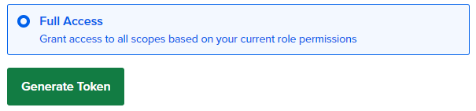

# Setting up a DigitalOcean droplet using doctl and cloud-init

# Table of contents
- [Table of contents](#table-of-contents)
- [Introduction](#introduction)
- [Installing and setting up doctl](#installing-and-setting-up-doctl)
- [Uploading a custom image to DigitalOcean](#uploading-a-custom-image-to-digitalocean)
- [Setting up SSH keys](#setting-up-ssh-keys)
- [Configuring cloud-init](#configuring-cloud-init)
- [Deploying the droplet](#deploying-the-droplet)
- [Verify everything worked](#verify-everything-worked)

# Introduction
This tutorial will walk you through the process of using the tools `doctl`, and `cloud-init` to set up an Arch Linux droplet on DigitalOcean. 

**Things we'll need:**
<!-- - A local machine running the cloud version of Arch Linux -->
- A DigitalOcean account
- An existing Arch Linux droplet
- A local machine running Microsoft Windows 10/11

>[!TIP]
>You will be copying and pasting into your terminal frequently throughout this tutorial. If you're using Command Prompt or Windows Powershell, you can enable copy/paste by clicking the icon on the top left of your terminal and choosing the **Properties** option. Once inside the **Properties** window, make sure to check the **Use Ctrl+Shift+C/V as Copy/Paste** checkbox.
---

# Installing and setting up doctl
`doctl` is the official DigitalOcean command line interface that allows you to do things like creating, configuring, and destroying DigitalOcean resources, such as Droplets. 

To get started, run the command:
```
sudo pacman -S doctl
```
Once you've installed `doctl`, we'll have to create a DigitalOcean Personal Access Token. This token will give `doctl` access to your DigitalOcean account.

1. Login to your DigitalOcean account
2. Find the navigation bar on the left and scroll down to the bottom until you see API


3. Click **API**
4. Click **Generate New Token**
5. Type in a token name
6. Choose your preferred token expiration date
7. Click **Full Access** in the **Scopes** section
8. Click **Generate Token**



>[!IMPORTANT]
>Once you've finished those steps, your token will be generated and you'll be given a token string. The token string will be shown to you only **once**. Ensure you copy it and store it in a safe place as you'll need it to authenticate `doctl`.
\
> 

Next, we'll give `doctl` your newly generated token string. To do that, run this command:
```
doctl auth init
```
You will be prompted to enter your access token string.


Now that your token has been validated, let's check that `doctl` has access to your DigitalOcean account.

Type in this command:
```
doctl account get
```
You should be faced with an output that looks like this:
```
Email                      Droplet Limit    Email Verified    UUID                                        Status
sammy@example.org          10               true              3a56c5e109736b50e823eaebca85708ca0e5087c    active
```
**Congratulations! You've successfully set up `doctl`!**

---

# Uploading a custom image to DigitalOcean
Before we can upload a custom image to DigitalOcean, we'll need to download an Arch Linux cloud image. You can find the latest image here: https://geo.mirror.pkgbuild.com/images/latest/

From the repository linked earlier, you'll want to copy the link to the cloud image ending in `.qcow2`.


Now that you have the Arch Linux cloud image link copied, we can run this next command to upload the image to your DigitalOcean account:
```
doctl compute image create <custom image name> --image-url <Arch Linux cloud image URL ending in .qcow2> --region sfo3 --image-distribution "Arch Linux"
```
>[!NOTE]
>For the purposes of this tutorial, we used the `sfo3` region slug to fulfill the `--region` argument. You can find a list of region slugs by running this command: 
>```
>doctl compute region list
>```

To verify that your custom image was successfully uploaded to DigitalOcean, run this command:
```
doctl compute image list | grep custom
```
You should see an output that looks something like this:
```
165999695    Image-name                                          custom         Arch Linux
```
**Congrats! You've successfully uploaded a custom Arch Linux cloud image to your DigitalOcean account.**

---

# Setting up SSH keys
Secure shell (SSH) is a network protocol used to initiate secure connections over an unsecured network. Through the secure connection, you can do things such as sending commands or transferring files, and more. SSH will be essential to accessing your DigitalOcean droplets.

We'll get started by creating an SSH public/private key-pair on your local machine using this command in your preferred terminal:
```
ssh-keygen -t ed25519 -f C:\Users\<your username>\.ssh\<key name> -C <youremail@email.com>
```
>[!TIP]
>You will often see some word or phrase between two angle brackets like this, `<word or phrase>`, throughout this tutorial. This means you need to type your own text here correlating to the word/phrase.
\
> Example: `ssh-keygen -t ed25519 -f C:\Users\Bob\.ssh\bobs-key -C "bob89@gmail.com"`

Once you've generated the public/private key-pair, you'll be able to find both keys in the .ssh folder within your user folder. They will look something like this: `bobs-key` and `bobs-key.pub`. `bobs-key` will stay on your local machine, while `bobs-key.pub` will be given to your DigitalOcean droplet. 

SSH will use this pair of keys to send back-and-forth encrypted messages from your local machine to the DigitalOcean droplet. The messages can only be decrypted if the public and private keys match. 

Now that you have new a new pair of SSH keys, we can head on over to our Arch Linux DigitalOcean droplet.

---

# Configuring cloud-init

# Deploying the droplet

# Verify everything worked

<!--
[^1]: doctl is a command-line interface tool used to interact with DigitalOcean's cloud services.
[^2]: cloud-init is an industry standard tool used for cloud instance initialization. 
-->